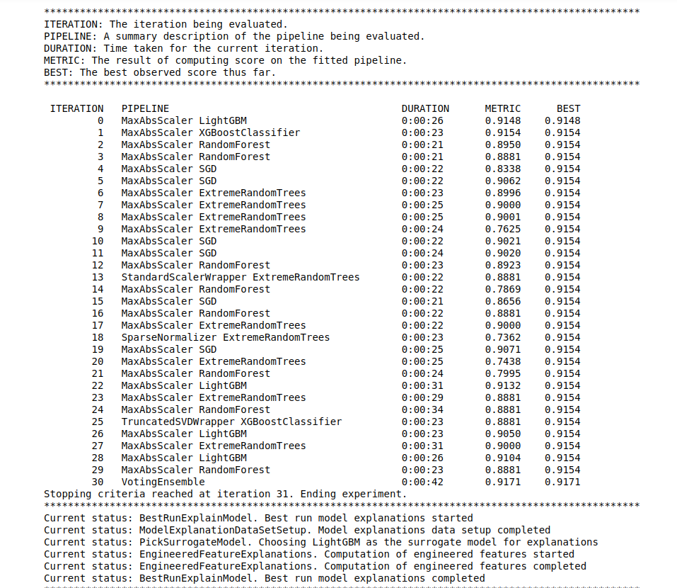

# Optimizing an ML Pipeline in Azure

## Overview
This project is part of the Udacity Azure ML Nanodegree.
In this project, we build and optimize an Azure ML pipeline using the Python SDK and a provided Scikit-learn model.
This model is then compared to an Azure AutoML run.

## Summary
**In 1-2 sentences, explain the problem statement: e.g "This dataset contains data about... we seek to predict..."**

The [dataset](https://automlsamplenotebookdata.blob.core.windows.net/automl-sample-notebook-data/bankmarketing_train.csv) used in this project contains bank marketting information. It has 20 main features with 32951 rows representing bank clients. We seek to use this data to predict the whether these clients made deposits or not.

**In 1-2 sentences, explain the solution: e.g. "The best performing model was a ..."**

The best performing model from was the __VotingEnsemble__ classification algorithm, as shown in the image below. Other algorithms included LightGBM, XGBoostClassifier, RandomForest, SGD, ExtremeRandomTrees, etc.

__VotingEnsemble__ works by combining the predictions from multiple models. It can be used for classification or regression. In this our classification task, the predictions for each label are summed and the label with the majority vote is predicted. More on the working of the VotingEnsemble model can be found [here](https://machinelearningmastery.com/voting-ensembles-with-python/).

## Scikit-learn Pipeline
**Explain the pipeline architecture, including data, hyperparameter tuning, and classification algorithm.**

The SKlearn pipeline consist of the `train.py` script and hyperparameter tuning using __Hyperdrive__. In the script, I create the dataset using the `TabularDatasetFactory`, clean the data and split it into `train` and `test` sets. In the Jupyter notebook, `Optimizing-an-ML-Pipeline-in-Azure-final.ipynb`, I then define an SKlearn estimator, a parameter sampler, an early stopping policy, and a HyperDriveConfig to tune the `--C` and `--max_iter` parameters.

- `--C` is the _Inverse of Regularization Strength_. Smaller values of this parameter cause stronger regularization.
- `--max_iter` is _Maximum number of iterations_ to converge. 

The config uses the `Accuracy` as the primary metric and a maximum of 20 runs. The image below shows the accuracy of `0.9096` from the best Hyperdrive run.

**What are the benefits of the parameter sampler you chose?**

Hyperparameters are adjustable parameters that let you control the model training process.
I chose the Random sampling using the `RandomParameterSampling()` class. Some of its benefits include:
- It supports early termination of low-performance runs. Since the Azure Labs provided for the project have limited time, this sampler allows me to maximize the time by terminating low-performance runs that would otherwise run for long only to give poor results.
- `RandomParameterSampling()` allows the user to do an initial search before and refining the search space to improve results.

**What are the benefits of the early stopping policy you chose?**

Specifying an early termination policy helps in automatically terminating poor performing runs. I chosed the `BanditPolicy` policy. Some of its benefits include:
- It terminates runs where the primary metric is not within the specified slack factor/slack amount compared to the best performing run, thereby not wasting time on runs that perform below the current best run.
- It has to do directly with the primary metric, which is exactly what I am focused on in this project. Therefore it is the best policy for this project.

## AutoML
**In 1-2 sentences, describe the model and hyperparameters generated by AutoML.**

In the AutoML run, the best model is __VotingEnsemble__ with an accuracy of `0.91707`. The algorithm has been explained earlier above. The hyperparameters were the AutoMLConfig are:
The most important feature was `duration`, followed by `nr.employed`, `cons.conf.idx`, and the others  as shown below.

 

As shown below, my stopping policy was applied at iteration 31.

## Pipeline comparison
**Compare the two models and their performance. What are the differences in accuracy? In architecture? If there was a difference, why do you think there was one?**

- The Hyperdrive run had an accuracy of `0.9096` while the AutoML run had `0.91707`. Therfore, AutoML out-performed Hyperdrive tunning.
- The arcitectures are similar.
- As expected, the AutoML run preforms better than Hyperdrive run because unlike Hyperdrive, AutoML is much stronger because it employs feature selection, model selection in addition to hyperparameter tuning. That accounts for the difference in performance.

## Future work
**What are some areas of improvement for future experiments? Why might these improvements help the model?**

Future work on this project can include:
- Tuning more parameters.
- Running the ML pipelines on larger datasets.
- Deploying with other frameworks like PyTorch and Keras.

## Proof of cluster clean up
**If you did not delete your compute cluster in the code, please complete this section. Otherwise, delete this section.**
**Image of cluster marked for deletion**

